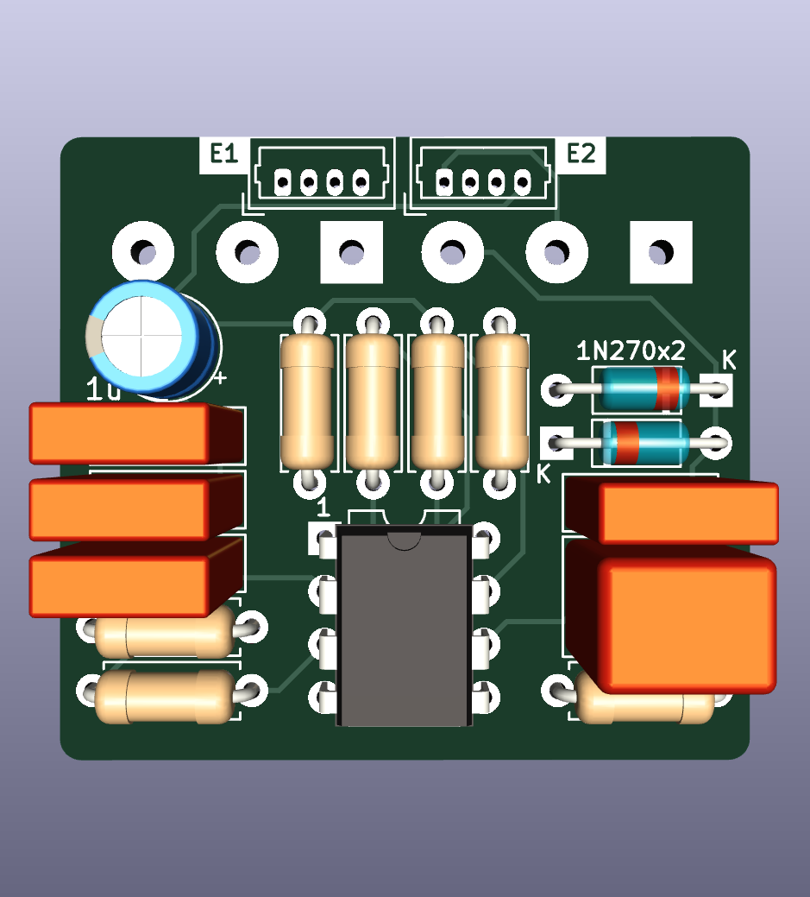
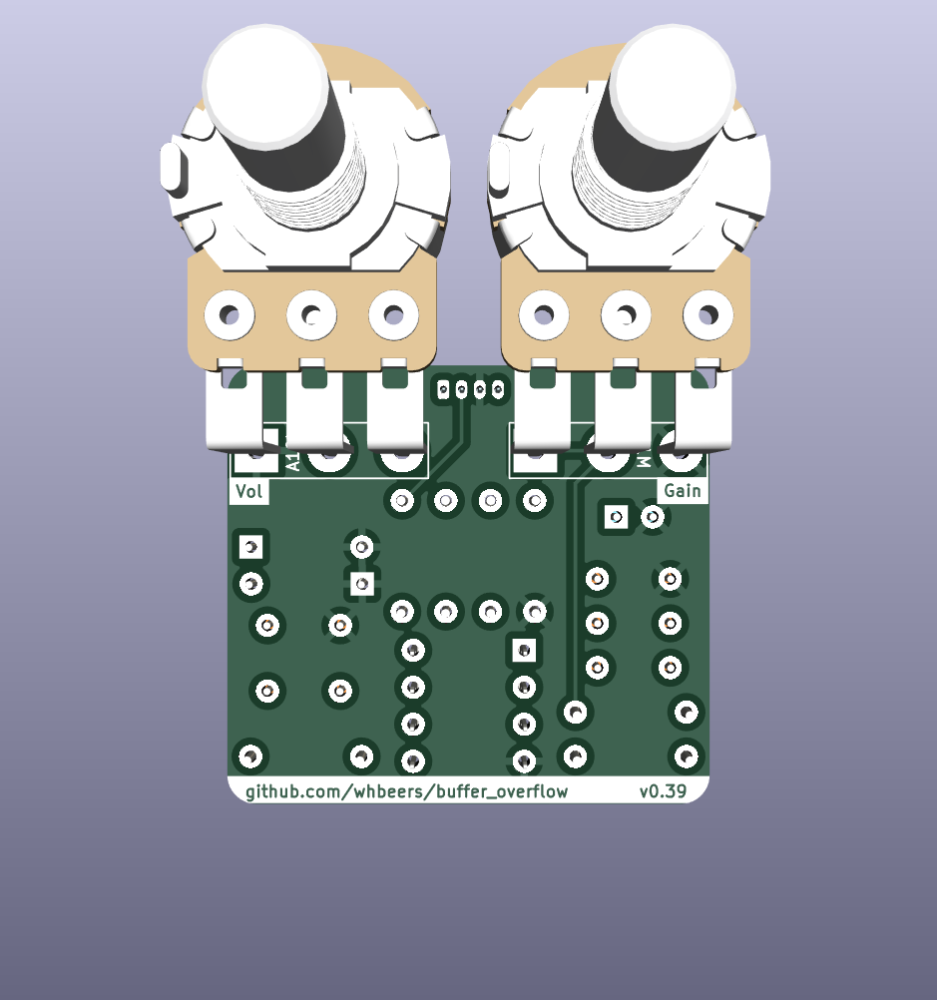

# Buffer Overflow Drive Effect

This is a re-creation of the DOD Overdrive 250 / MXR Distortion+ op-amp drive circuit, as a first attempt at basic PCB design in [KiCAD](https://www.kicad.org/). 

[Schematic](hardware/BufferOverflow_schematic_v0.01.pdf)

## Credit
The basic schematic I worked from is available from a variety of sources, but this was primarily derived from the [PedalPCB Distortion 250](https://www.pedalpcb.com/product/dist250/). I strongly endorse PedalPCB (and this pedal) as a great way to get started building effects.

## BOM

TODO

## Assembly

The effect is designed to be assembled in a similar way to other PedalPCB effects, and is compatible with their [3PDT footswitch utility PCB](https://www.pedalpcb.com/product/3pdt/). More detailed instructions TODO, for now refer to PedalPCB instructions... and buy thier PCBs.

## Name
*The name "Buffer Overflow" is a reflection of the nature of the effect (an overdrive) and security nerdery.*