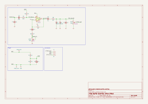

# Buffer Overflow Drive Effect

This is a re-creation of the DOD Overdrive 250 / MXR Distortion+ op-amp drive circuit, as a first attempt at basic PCB design in [KiCAD](https://www.kicad.org/). 

The board is built on the ["Noise Floor"](https://github.com/whbeers/noise_floor) pedal platform, which provides basic power protection, audio IO, and a footswitch with LED indicator.

[Schematic PDF](schematics/buffer_overflow-latest.pdf)

## Credit
The basic schematic I worked from is available from a variety of sources, but this was primarily derived from the [PedalPCB Distortion 250](https://www.pedalpcb.com/product/dist250/). I strongly endorse PedalPCB (and this pedal) as a great way to get started building effects.

Thanks also to [Vasily Kashirin](https://grabcad.com/vasily.kashirin-1) for the awesome step models for potentiometers and jacks, and to folks on the [freestompboxes.org](https://www.freestompboxes.org/) forum for feedback and suggestions!

*I am not affiliated with any of the brands, sites, or products named in this overview.*

## Versioning

My pcb designs utilize the following versioning scheme (I'll add to this as I produce more revisions):
 - v0.0XX: A candidate design that has not yet been produced and tested.
 - v0.XX: A design that has been produced, tested, and any initial errors addressed.

## Planned TODOs before v0.40
 - Re-place and re-route lower connector to top of board, in alignment to the approach I've taken with the [Noise Floor](https://github.com/whbeers/noise_floor) utility board. [DONE in v0.35!]
 - Later, migrate indicator LED and power protection circuit to Noise Floor. [DONE in v0.35!]
 - Clean up and condense the layout [DONE in v0.38!]
 - Fix any issues I identify with produced v0.30 boards.

## Name
*The name "Buffer Overflow" is a reflection of the nature of the effect (an overdrive) and security nerdery.*
