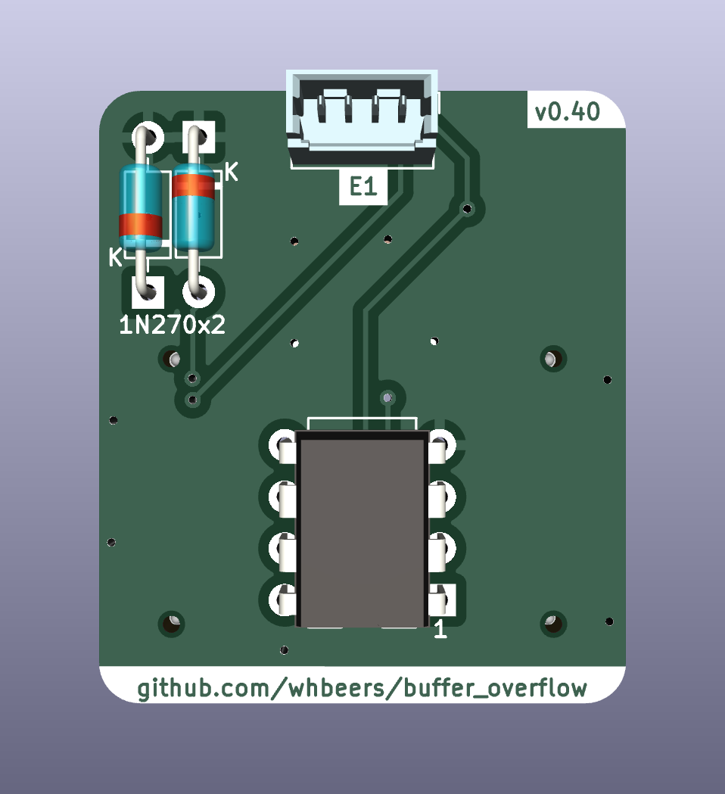

# Buffer Overflow Drive Effect

This is a re-creation of the DOD Overdrive 250 / MXR Distortion+ op-amp drive circuit, as a first attempt at basic PCB design in [KiCAD](https://www.kicad.org/). 

The board is built on the ["Noise Floor"](https://github.com/whbeers/noise_floor) pedal platform, which provides basic power protection, audio IO, and a footswitch with LED indicator.

[Schematic PDF](schematics/buffer_overflow-latest.pdf)

## Credit
The basic schematic I worked from is available from a variety of sources, but this was primarily derived from the [PedalPCB Distortion 250](https://www.pedalpcb.com/product/dist250/). I strongly endorse PedalPCB (and this pedal) as a great way to get started building effects.

Thanks as always to the folks on the [freestompboxes.org](https://www.freestompboxes.org/) forum for feedback and suggestions.

Conan Lite footprints adapted from the 51-position footprints available from SnapEDA: [Header](https://www.snapeda.com/parts/10162582-1134151LF/Amphenol%20ICC%20(FCI)/view-part/), [Receptacle](https://www.snapeda.com/parts/10162581-3134151LF/Amphenol%20ICC%20(FCI)/view-part/).([Additional license details](hardware/SnapEDA_Licensing.txt)). 3D models courtesy Amphenol.

*I am not affiliated with any of the brands, sites, or products named in this overview.*

## Versioning

My pcb designs utilize the following versioning scheme (I'll add to this as I produce more revisions):
 - v0.0XX: A candidate design that has not yet been produced and tested.
 - v0.XX: A design that has been produced, tested, and any initial errors addressed.

## Note on v0.40

v0.40 updates Buffer Overflow as a proof-of-concept for the experimental [Noise Floor](https://github.com/whbeers/noise_floor) UX board, which uses board-to-board connectors to modularize the control surface the effect. While it only exercises two potentiometers from the UX board, I may expand use of it (e.g. switchable clipping diode banks, etc).

I've also changed resistors and capacitors to 1206 SMD parts. Due to the fact that the board-to-board assemblies are also surface mount, it meant moving almost all parts to the back of the board. This resulted in an awkward-looking layout, to say the least, and I expect it to evolve over time.

## Name
*The name "Buffer Overflow" is a reflection of the nature of the effect (an overdrive) and security nerdery.*
